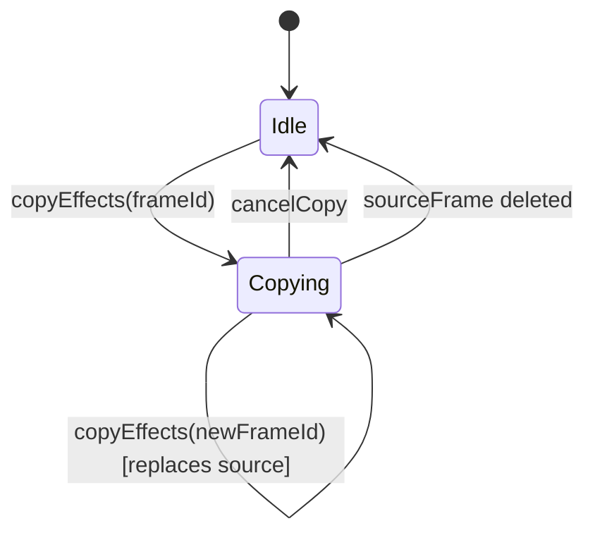

# Design Document — timeline-effects-copy

## Overview

This feature adds a copy-paste effects workflow to the GIF Creator timeline. A user can pick any frame as a source, choose which of its five effect categories to copy (animation, transition, text, stickers, crop), and then apply those effects to one frame, a hand-picked subset, or every other frame in the timeline.

The implementation lives entirely inside the existing `TimelineEditor` / `TimelineItem` component tree. No external state management library is introduced; all new state is managed with `useState` / `useRef` inside `TimelineEditor`, following the project's existing conventions.

---

## Architecture

The feature is a pure client-side state machine layered on top of the existing `frames` state. It introduces three new pieces of state inside `TimelineEditor`:

```
effectClipboard: EffectClipboard | null
effectMask:      EffectMask
targetFrameIds:  Set<string>
```

All paste operations are expressed as pure functions that take the current `frames` array plus the clipboard/mask and return a new `frames` array, which is then handed to `setFrames`. This keeps the logic testable in isolation.

An undo stack (`undoStack: FrameImage[][]`) stores snapshots of `frames` before each paste so that `Ctrl+Z` can restore the previous state.

### State machine overview



### Component responsibility split

| Component | Responsibility |
|---|---|
| `TimelineEditor` | Owns all clipboard state; exposes callbacks to children |
| `TimelineItem` | Receives `isSource`, `isTarget`, `canPaste`, `effectMask` props; renders visual indicators and triggers callbacks |
| `CopyEffectsMenu` (new) | Inline panel rendered inside `TimelineEditor`; manages category toggle UI |
| `EffectsStatusBanner` (new) | Persistent banner rendered inside `TimelineEditor` while clipboard is active |
| `PasteNotification` (new) | Transient toast rendered inside `TimelineEditor`; auto-dismisses after 3 s |

---

## Components and Interfaces

### New TypeScript types (`src/types.ts` additions)

```typescript
export type EffectCategory = 'animation' | 'transition' | 'text' | 'stickers' | 'crop';

export interface EffectClipboard {
  sourceFrameId: string;
  /** Snapshot of the source frame's effects at the moment of copy */
  sourceEffects: Pick<FrameImage, 'animation' | 'transition' | 'transitionDuration' | 'text' | 'stickers' | 'crop'>;
}

export type EffectMask = Set<EffectCategory>;
```

### `CopyEffectsMenu` props

```typescript
interface CopyEffectsMenuProps {
  sourceFrame: FrameImage;
  mask: EffectMask;
  onToggleCategory: (cat: EffectCategory) => void;
  onSelectAll: () => void;
  onDeselectAll: () => void;
  onConfirm: () => void;   // closes menu, mask is already live
  onCancel: () => void;
}
```

The menu is shown as an inline panel below the timeline strip (not a modal) so the user can still see the timeline while choosing categories. It uses the existing dark-card / border-dark-border styling.

### `TimelineItem` — new props

```typescript
// Added to TimelineItemProps:
isSource?:    boolean;   // frame is the Effect_Clipboard source
isTarget?:    boolean;   // frame is a marked Target_Frame
canPaste?:    boolean;   // clipboard active and frame is not source
effectMask?:  EffectMask; // for tooltip content
onCopyEffects?:  (id: string) => void;
onPasteEffects?: (id: string) => void;
onToggleTarget?: (id: string) => void;
```

### `EffectsStatusBanner` props

```typescript
interface EffectsStatusBannerProps {
  sourceIndex: number;       // 1-based display index
  mask: EffectMask;
  targetCount: number;
  onPasteToSelected: () => void;
  onPasteToAll: () => void;
  onSelectAllTargets: () => void;
  onCancel: () => void;
}
```

### `PasteNotification` props

```typescript
interface PasteNotificationProps {
  count: number;             // number of frames updated
  onDismiss: () => void;
}
```

---

## Data Models

### `EffectClipboard`

Stores a snapshot of the source frame's effects at copy time (not a live reference). This means subsequent edits to the source frame do not silently change what will be pasted.

```typescript
interface EffectClipboard {
  sourceFrameId: string;
  sourceEffects: {
    animation: AnimationType;
    transition: TransitionType;
    transitionDuration: number;
    text?: TextOverlay;
    stickers: StickerOverlay[];
    crop?: CropSettings;
  };
}
```

### `EffectMask`

A `Set<EffectCategory>` where presence means "include this category in paste". Using a `Set` makes toggle, selectAll, and deselectAll O(1) and avoids boolean flag proliferation.

### Undo stack

```typescript
// Inside TimelineEditor state
const [undoStack, setUndoStack] = useState<FrameImage[][]>([]);
```

Before every paste operation, the current `frames` snapshot is pushed onto the stack. `Ctrl+Z` pops the top snapshot and calls `setFrames` with it. The stack is cleared when the clipboard is cleared.

### Active-effect detection helper

```typescript
export function hasEffect(frame: FrameImage, cat: EffectCategory): boolean {
  switch (cat) {
    case 'animation':  return frame.animation !== 'none';
    case 'transition': return frame.transition !== 'none';
    case 'text':       return !!(frame.text?.content);
    case 'stickers':   return frame.stickers.length > 0;
    case 'crop':       return !!(frame.crop && frame.crop.shape !== 'none');
  }
}
```

### Paste logic (pure function)

```typescript
export function applyEffectMask(
  target: FrameImage,
  source: EffectClipboard['sourceEffects'],
  mask: EffectMask
): FrameImage {
  const updated = { ...target };
  if (mask.has('animation'))  { updated.animation = source.animation; }
  if (mask.has('transition')) {
    updated.transition = source.transition;
    updated.transitionDuration = source.transitionDuration;
  }
  if (mask.has('text'))       { updated.text = source.text; }
  if (mask.has('stickers'))   { updated.stickers = [...source.stickers]; }
  if (mask.has('crop'))       { updated.crop = source.crop ? { ...source.crop } : undefined; }
  return updated;
}
```

---

## Correctness Properties

### Property 1: Copy stores the correct source frame id

*For any* frame id, calling `copyEffects(frameId)` should result in `effectClipboard.sourceFrameId === frameId`.

**Validates: Requirements 1.1**

---

### Property 2: Category active state matches frame effects

*For any* `FrameImage`, the active/inactive state of each category displayed in `Copy_Effects_Menu` should equal the result of `hasEffect(frame, category)` for each of the five categories.

**Validates: Requirements 1.3**

---

### Property 3: Effect_Mask reflects confirmed selection exactly

*For any* non-empty subset of the five effect categories, confirming that selection in `Copy_Effects_Menu` should result in `effectMask` containing exactly those categories — no more, no less.

**Validates: Requirements 2.1, 2.2**

---

### Property 4: Paste only modifies masked properties

*For any* source `EffectClipboard`, target `FrameImage`, and `EffectMask`, after calling `applyEffectMask(target, source.sourceEffects, mask)`:
- Every property in the mask on the result equals the corresponding value from `source.sourceEffects`.
- Every property **not** in the mask on the result equals the corresponding value from the original `target`.

**Validates: Requirements 3.2**

---

### Property 5: Apply-to-all leaves source frame unchanged

*For any* list of frames and any source frame id, after `pasteToAll`, every frame except the source has its masked properties updated from the source, and the source frame itself is byte-for-byte identical to its pre-paste value.

**Validates: Requirements 3.3**

---

### Property 6: Apply-to-selected excludes source even when included

*For any* list of frames, source frame id, and set of target frame ids (which may include the source), after `pasteToSelected`:
- Frames in `targetFrameIds` that are **not** the source have their masked properties updated.
- The source frame is unchanged.
- Frames neither in `targetFrameIds` nor the source are unchanged.

**Validates: Requirements 3.4, 3.5**

---

### Property 7: Paste-eligible set excludes source

*For any* list of frames and any source frame id, when the clipboard is active, the set of frames for which `canPaste === true` should equal all frame ids **except** the source frame id.

**Validates: Requirements 3.1**

---

### Property 8: Select-all targets marks all frames except source

*For any* list of frames and any source frame id, after `selectAllTargets`, `targetFrameIds` should contain every frame id in the list except the source frame id.

**Validates: Requirements 4.4**

---

### Property 9: Target count equals size of targetFrameIds

*For any* subset of frames marked as targets, the count displayed in the status banner should equal `targetFrameIds.size`.

**Validates: Requirements 4.3**

---

### Property 10: New copy replaces clipboard source

*For any* two different frame ids A and B, after `copyEffects(A)` followed by `copyEffects(B)`, `effectClipboard.sourceFrameId` should equal B.

**Validates: Requirements 5.2**

---

### Property 11: Undo restores all affected frames

*For any* paste operation (any source, any target set, any mask), after paste then undo (`Ctrl+Z`), every frame that was modified by the paste should have its exact pre-paste values restored, and unaffected frames should remain unchanged.

**Validates: Requirements 5.4**

---

### Property 12: Status banner reflects active mask categories

*For any* active `EffectClipboard` and `EffectMask`, the categories listed in the status banner should be exactly the categories present in `effectMask`.

**Validates: Requirements 6.3**

---

### Property 13: Paste tooltip lists active mask categories

*For any* `EffectMask`, the tooltip shown on paste-eligible `TimelineItem` components should contain exactly the names of the categories present in the mask.

**Validates: Requirements 6.5**

---

## Error Handling

### Source frame deleted while clipboard is active

`TimelineEditor` already has a `useEffect` that watches `frames` to auto-select the first frame when the selected frame is removed. The same pattern is extended: if `effectClipboard?.sourceFrameId` is no longer present in `frames`, the clipboard, mask, and target set are all cleared.

```typescript
useEffect(() => {
  if (effectClipboard && !frames.find(f => f.id === effectClipboard.sourceFrameId)) {
    clearClipboard();
  }
}, [frames, effectClipboard]);
```

### Empty paste (no frames updated)

If `pasteToSelected` is called with an empty `targetFrameIds` (or a set containing only the source), the operation is a no-op. No undo snapshot is pushed and no notification is shown.

### Confirm with empty mask

The confirm button in `CopyEffectsMenu` is disabled when `mask.size === 0`. The paste action buttons in `EffectsStatusBanner` are also disabled in this state.

### Concurrent drag-and-drop

The DnD reorder operation in `TimelineEditor` does not interact with clipboard state. Frame ids are stable across reorders, so the clipboard remains valid after a drag. The source frame's visual indicator will move with the frame as expected.

---

## Testing Strategy

### Test framework setup

Add to `devDependencies`:
- `vitest` — test runner (Vite-native, zero config)
- `@vitest/ui` — optional UI
- `fast-check` — property-based testing library
- `@testing-library/react` + `@testing-library/user-event` — component tests
- `jsdom` — DOM environment for Vitest

### Unit tests (example-based)

Focus on specific scenarios and edge cases:

- `CopyEffectsMenu` renders all 5 categories
- `CopyEffectsMenu` disables confirm when no category is selected
- `CopyEffectsMenu` select-all / deselect-all quick actions
- `EffectsStatusBanner` renders source index and category names
- `PasteNotification` auto-dismisses after 3 seconds
- Removing source frame clears clipboard (Requirement 5.3)
- Cancel clears clipboard, mask, and target set (Requirement 5.1)
- Multi-select mode is enabled when clipboard is active (Requirement 4.1)

### Property-based tests (fast-check)

Each property test runs a minimum of **100 iterations**. Each test is tagged with a comment referencing the design property.

Tag format: `// Feature: timeline-effects-copy, Property N: <property_text>`

**Properties to implement as PBT:**

| Test file | Properties covered |
|---|---|
| `effectClipboard.test.ts` | P1, P2, P3, P10 |
| `applyEffectMask.test.ts` | P4, P5, P6, P7 |
| `targetSelection.test.ts` | P8, P9 |
| `undoStack.test.ts` | P11 |
| `statusBanner.test.ts` | P12, P13 |

**Arbitraries needed:**

```typescript
// Arbitrary for AnimationType
const arbAnimation = fc.constantFrom('none','zoom-in','zoom-out','pan-left','pan-right','fade-in','fade-out');

// Arbitrary for TransitionType
const arbTransition = fc.constantFrom('none','crossfade','slide-left','slide-right','wipe-left','wipe-right');

// Arbitrary for EffectCategory subset
const arbMask = fc.array(
  fc.constantFrom('animation','transition','text','stickers','crop'),
  { minLength: 0, maxLength: 5 }
).map(cats => new Set(cats) as EffectMask);

// Arbitrary for FrameImage (effects only — file/previewUrl stubbed)
const arbFrame = fc.record({
  id: fc.uuid(),
  animation: arbAnimation,
  transition: arbTransition,
  transitionDuration: fc.float({ min: 0.1, max: 2.0 }),
  text: fc.option(fc.record({ content: fc.string({ minLength: 1 }) }), { nil: undefined }),
  stickers: fc.array(fc.record({ id: fc.uuid(), emoji: fc.string() })),
  crop: fc.option(fc.record({ shape: fc.constantFrom('circle','rectangle','none') }), { nil: undefined }),
  duration: fc.float({ min: 0.1, max: 10 }),
  file: fc.constant(new File([], 'stub.png')),
  previewUrl: fc.constant('data:image/png;base64,stub'),
});
```

### Integration / smoke tests

- Verify `TimelineEditor` renders without errors when clipboard state is active (smoke)
- Verify `setFrames` is called with the correct updated array after paste (integration with React Testing Library)
