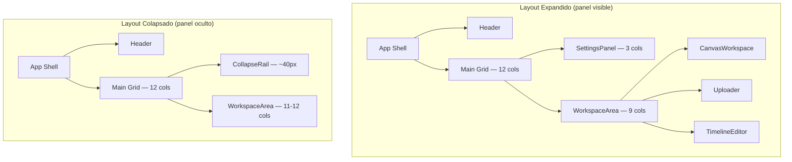
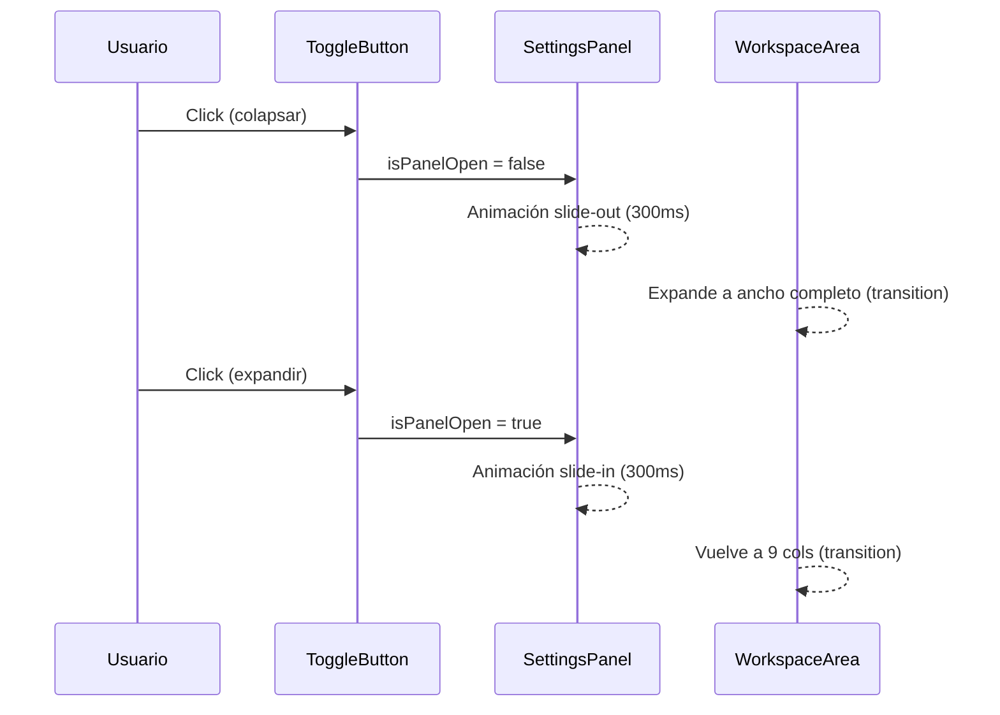
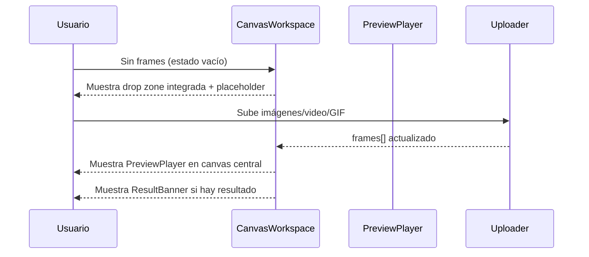

# Design Document: UX/UI Reconstruction — GifCreatorPro

## Overview

GifCreatorPro necesita dos mejoras estructurales en su interfaz: un panel lateral de ajustes colapsable y un área de canvas central como espacio de trabajo principal para visualizar y editar los frames del GIF. El objetivo es maximizar el espacio de trabajo cuando el usuario no necesita los ajustes, y ofrecer una experiencia de edición más visual y centrada en el contenido.

El proyecto es una SPA React 19 + TypeScript + Vite con Tailwind CSS v4, tema oscuro (`#000000` / `#0F0F23`), acento rojo (`#E11D48`), y usa `lucide-react` para iconografía. No hay router; toda la UI vive en `App.tsx`.

---

## Architecture

### Layout General (estado expandido vs. colapsado)



### Flujo de interacción del toggle



### Flujo del Canvas Workspace



---

## Components and Interfaces

### Component 1: `CollapsibleSettingsPanel`

**Purpose**: Envuelve `SettingsPanel` con lógica de colapso/expansión animada. Expone un botón de toggle integrado en su borde derecho.

**Interface**:
```typescript
interface CollapsibleSettingsPanelProps {
  settings: RenderSettings;
  setSettings: React.Dispatch<React.SetStateAction<RenderSettings>>;
  onGenerate: () => void;
  isRendering: boolean;
  progress: number;
  hasFrames: boolean;
  isFfmpegLoaded: boolean;
  isOpen: boolean;
  onToggle: () => void;
}
```

**Responsabilidades**:
- Renderizar `SettingsPanel` cuando `isOpen === true`
- Mostrar un rail colapsado con el botón de toggle cuando `isOpen === false`
- Animar la transición con CSS `transition` (width + opacity, 300ms ease)
- El botón de toggle siempre visible (en el borde del panel o en el rail)
- Accesibilidad: `aria-expanded`, `aria-label` en el botón de toggle

**Estructura visual**:
```
┌─────────────────────┬──┐
│  SettingsPanel      │ ◀│  ← botón toggle (siempre visible)
│  (contenido)        │  │
└─────────────────────┴──┘

Estado colapsado:
┌──┐
│ ▶│  ← rail estrecho con solo el botón
└──┘
```

---

### Component 2: `CanvasWorkspace`

**Purpose**: Área de trabajo central que unifica el `PreviewPlayer`, el `Uploader`, el banner de resultado y el estado vacío en una sola zona coherente con aspecto de "canvas de edición".

**Interface**:
```typescript
interface CanvasWorkspaceProps {
  frames: FrameImage[];
  settings: RenderSettings;
  resultUrl: string | null;
  isExtractingGif: boolean;
  selectedVideo: File | null;
  isRemoving: boolean;
  bgProgress: number;
  playerRef: React.RefObject<PreviewPlayerRef | null>;
  isPlaying: boolean;
  currentTime: number;
  onPlayStateChange: (playing: boolean) => void;
  onTimeUpdate: (time: number) => void;
  onUpload: (frames: FrameImage[]) => void;
  onVideoSelect: (file: File) => void;
  onGifSelect: (file: File) => void;
  onResultDismiss: () => void;
  onResultDownload: () => void;
  onRemoveBackground: () => void;
  onClearFrames: () => void;
}
```

**Responsabilidades**:
- Estado vacío: mostrar drop zone prominente con instrucciones
- Estado con frames: mostrar `PreviewPlayer` como elemento principal del canvas
- Mostrar `ResultBanner` cuando `resultUrl !== null`
- Mostrar spinner de extracción cuando `isExtractingGif === true`
- Integrar `VideoTrimmer` modal cuando `selectedVideo !== null`
- Contener la galería de frames (`TimelineEditor`) debajo del canvas

**Layout interno**:
```
┌─────────────────────────────────────────┐
│  CanvasWorkspace                        │
│  ┌───────────────────────────────────┐  │
│  │  ResultBanner (condicional)       │  │
│  └───────────────────────────────────┘  │
│  ┌───────────────────────────────────┐  │
│  │  PreviewPlayer / EmptyState       │  │  ← área canvas principal
│  └───────────────────────────────────┘  │
│  ┌───────────────────────────────────┐  │
│  │  Uploader (drop zone)             │  │
│  └───────────────────────────────────┘  │
│  ┌───────────────────────────────────┐  │
│  │  TimelineEditor (galería)         │  │
│  └───────────────────────────────────┘  │
└─────────────────────────────────────────┘
```

---

### Component 3: `PanelToggleButton`

**Purpose**: Botón de icono que controla el estado abierto/cerrado del panel. Siempre visible, posicionado en el borde del panel.

**Interface**:
```typescript
interface PanelToggleButtonProps {
  isOpen: boolean;
  onClick: () => void;
  className?: string;
}
```

**Responsabilidades**:
- Mostrar `ChevronLeft` cuando el panel está abierto
- Mostrar `ChevronRight` cuando el panel está cerrado
- Transición suave del icono (rotate transform, 300ms)
- `aria-label` dinámico: "Ocultar ajustes" / "Mostrar ajustes"

---

## Data Models

### Estado de UI en `App.tsx`

```typescript
// Estado nuevo a agregar en App.tsx
const [isPanelOpen, setIsPanelOpen] = useState<boolean>(true);

// Persistencia opcional en localStorage
// key: 'gifcreator-panel-open'
```

No se requieren cambios en `RenderSettings`, `FrameImage` ni ningún tipo de dominio existente. El cambio es puramente de presentación/layout.

---

## Algorithmic Pseudocode

### Algoritmo: Toggle del Panel

```pascal
PROCEDURE togglePanel(currentState: boolean): boolean
  INPUT: currentState — estado actual del panel (abierto/cerrado)
  OUTPUT: nextState — nuevo estado

  SEQUENCE
    nextState ← NOT currentState
    
    IF localStorage IS available THEN
      localStorage.setItem('gifcreator-panel-open', nextState.toString())
    END IF
    
    RETURN nextState
  END SEQUENCE
END PROCEDURE
```

**Precondiciones:**
- `currentState` es un booleano válido

**Postcondiciones:**
- El estado retornado es el inverso del estado de entrada
- Si localStorage está disponible, el estado se persiste

---

### Algoritmo: Resolución del Layout Grid

```pascal
PROCEDURE resolveGridLayout(isPanelOpen: boolean): GridConfig
  INPUT: isPanelOpen — si el panel está visible
  OUTPUT: config — clases CSS para el grid

  SEQUENCE
    IF isPanelOpen THEN
      panelCols ← "lg:col-span-4 xl:col-span-3"
      workspaceCols ← "lg:col-span-8 xl:col-span-9"
    ELSE
      panelCols ← "w-10 flex-shrink-0"   // rail estrecho ~40px
      workspaceCols ← "flex-1"            // ocupa todo el espacio restante
    END IF
    
    RETURN { panelCols, workspaceCols }
  END SEQUENCE
END PROCEDURE
```

**Precondiciones:**
- `isPanelOpen` es un booleano

**Postcondiciones:**
- Las clases retornadas son mutuamente excluyentes y cubren el 100% del ancho disponible

---

### Algoritmo: Renderizado del CanvasWorkspace

```pascal
PROCEDURE renderCanvasWorkspace(props: CanvasWorkspaceProps): ReactNode
  INPUT: props — todas las props del componente
  OUTPUT: JSX del área de trabajo

  SEQUENCE
    // Determinar estado del canvas
    IF props.frames.length = 0 AND NOT props.isExtractingGif THEN
      canvasContent ← <EmptyDropZone />
    ELSE IF props.isExtractingGif THEN
      canvasContent ← <ExtractionSpinner />
    ELSE
      canvasContent ← <PreviewPlayer ref={props.playerRef} ... />
    END IF

    // Construir layout
    RETURN (
      <div className="flex flex-col space-y-6">
        IF props.resultUrl ≠ null THEN
          <ResultBanner ... />
        END IF
        
        {canvasContent}
        
        <Uploader ... />
        
        IF props.selectedVideo ≠ null THEN
          <VideoTrimmer ... />
        END IF
        
        IF props.frames.length > 0 THEN
          <TimelineEditor ... />
        ELSE
          <EmptyFramesPlaceholder />
        END IF
      </div>
    )
  END SEQUENCE
END PROCEDURE
```

**Precondiciones:**
- `props.frames` es un array (puede estar vacío)
- `props.playerRef` es un ref válido de React

**Postcondiciones:**
- Siempre se renderiza exactamente uno de: EmptyDropZone, ExtractionSpinner, PreviewPlayer
- El Uploader siempre está presente (permite añadir más frames)
- TimelineEditor solo aparece cuando hay frames

---

## Key Functions with Formal Specifications

### `useIsPanelOpen(): [boolean, () => void]`

```typescript
function useIsPanelOpen(): [boolean, () => void]
```

**Precondiciones:**
- Hook llamado dentro de un componente React

**Postcondiciones:**
- Retorna `[state, toggleFn]`
- `state` inicializado desde `localStorage` si existe, sino `true`
- `toggleFn()` invierte `state` y persiste en `localStorage`
- No produce efectos secundarios fuera de state + localStorage

**Loop Invariants:** N/A

---

### `CollapsibleSettingsPanel` render

```typescript
function CollapsibleSettingsPanel(props: CollapsibleSettingsPanelProps): JSX.Element
```

**Precondiciones:**
- `props.isOpen` es booleano
- `props.onToggle` es función sin argumentos

**Postcondiciones:**
- Si `isOpen === true`: renderiza el panel completo con botón de colapso visible
- Si `isOpen === false`: renderiza solo el rail con botón de expansión
- La transición CSS siempre se aplica (no hay cambio instantáneo)
- El botón de toggle siempre es accesible por teclado

---

## Example Usage

```typescript
// En App.tsx — integración del nuevo estado y componentes
function App() {
  const [isPanelOpen, setIsPanelOpen] = useState(true);
  // ... resto del estado existente

  return (
    <div className="min-h-screen p-4 md:p-8 flex flex-col">
      <Header />

      <div className="flex-1 flex gap-8">
        {/* Panel colapsable */}
        <CollapsibleSettingsPanel
          isOpen={isPanelOpen}
          onToggle={() => setIsPanelOpen(p => !p)}
          settings={settings}
          setSettings={setSettings}
          onGenerate={handleGenerate}
          isRendering={rendering}
          progress={progress}
          hasFrames={frames.length > 0}
          isFfmpegLoaded={loaded}
        />

        {/* Área de trabajo principal */}
        <CanvasWorkspace
          frames={frames}
          settings={settings}
          resultUrl={resultUrl}
          isExtractingGif={isExtractingGif}
          selectedVideo={selectedVideo}
          playerRef={playerRef}
          isPlaying={isPlaying}
          currentTime={currentTime}
          onPlayStateChange={setIsPlaying}
          onTimeUpdate={setCurrentTime}
          onUpload={handleUpload}
          onVideoSelect={setSelectedVideo}
          onGifSelect={handleGifSelect}
          onResultDismiss={() => setResultUrl(null)}
          onResultDownload={handleDownload}
          onRemoveBackground={() => removeBackgroundFromFrames(frames, setFrames)}
          onClearFrames={() => setFrames([])}
          isRemoving={isRemoving}
          bgProgress={bgProgress}
        />
      </div>
    </div>
  );
}
```

---

## Correctness Properties

### Property 1: Exclusividad del estado del canvas

**Validates: Requirements 2.4**

En cualquier momento, exactamente uno de `{EmptyDropZone, ExtractionSpinner, PreviewPlayer}` está visible en el área de canvas principal.

```typescript
// Para cualquier combinación de props:
// frames.length === 0 && !isExtractingGif → EmptyDropZone visible
// isExtractingGif === true → ExtractionSpinner visible
// frames.length > 0 && !isExtractingGif → PreviewPlayer visible
// Nunca dos estados activos simultáneamente
```

### Property 2: Persistencia del toggle

**Validates: Requirements 1.4**

Si el usuario colapsa el panel y recarga la página, el panel permanece colapsado (estado recuperado de localStorage).

```typescript
// Para cualquier valor booleano b:
// localStorage.setItem('gifcreator-panel-open', String(b))
// → useIsPanelOpen() inicializa con b al montar
```

### Property 3: Cobertura del layout

**Validates: Requirements 1.8**

`panelWidth + workspaceWidth = 100%` del contenedor en todo momento, independientemente del estado del panel.

```typescript
// isPanelOpen === true  → panel: col-span-3/4, workspace: col-span-8/9 (suma 12)
// isPanelOpen === false → panel: ~40px rail, workspace: flex-1 (ocupa resto)
```

### Property 4: Accesibilidad del toggle

**Validates: Requirements 1.6**

El botón de toggle siempre tiene `aria-label` descriptivo y es alcanzable por teclado (Tab + Enter/Space).

```typescript
// isOpen === true  → aria-label="Ocultar ajustes"
// isOpen === false → aria-label="Mostrar ajustes"
// El botón siempre está en el DOM (no se desmonta)
```

### Property 5: No regresión del Uploader

**Validates: Requirements 2.5**

El `Uploader` siempre está presente en el `CanvasWorkspace`, independientemente del estado de frames o del panel.

```typescript
// Para cualquier valor de frames.length, isExtractingGif, isPanelOpen:
// CanvasWorkspace siempre renderiza <Uploader />
```

### Property 6: Animación no bloqueante

**Validates: Requirements 4.5**

La transición del panel (300ms) no bloquea la interacción con el resto de la UI.

```typescript
// La transición usa CSS transition (no JS setTimeout/Promise)
// pointer-events permanecen activos en WorkspaceArea durante la animación
```

---

## Error Handling

### Escenario 1: localStorage no disponible

**Condición**: El navegador bloquea el acceso a `localStorage` (modo privado estricto, iframe sandboxed).
**Respuesta**: El hook `useIsPanelOpen` captura la excepción con `try/catch` y usa el valor por defecto `true`.
**Recuperación**: La UI funciona normalmente sin persistencia; el panel siempre inicia abierto.

### Escenario 2: Frames vacíos tras limpiar

**Condición**: El usuario hace clic en "Limpiar todo" y `frames` queda vacío.
**Respuesta**: `CanvasWorkspace` detecta `frames.length === 0` y muestra `EmptyDropZone`.
**Recuperación**: El `Uploader` sigue disponible para subir nuevos archivos.

### Escenario 3: Resize extremo (pantalla muy estrecha)

**Condición**: Viewport < 768px con panel abierto.
**Respuesta**: En mobile el panel se apila verticalmente (layout `flex-col`), el toggle se oculta o se convierte en un botón flotante.
**Recuperación**: El layout responsive de Tailwind maneja el breakpoint `lg:` para activar el grid de dos columnas.

---

## Testing Strategy

### Unit Testing Approach

- Probar `useIsPanelOpen`: toggle invierte el estado, persiste en localStorage, recupera desde localStorage al montar.
- Probar `PanelToggleButton`: renderiza el icono correcto según `isOpen`, dispara `onClick`, tiene `aria-label` correcto.
- Probar `CanvasWorkspace`: renderiza `EmptyDropZone` cuando `frames=[]`, renderiza `PreviewPlayer` cuando `frames.length > 0`, renderiza `ExtractionSpinner` cuando `isExtractingGif=true`.

### Property-Based Testing Approach

**Property Test Library**: fast-check (ya instalado en el proyecto)

- **Propiedad 1 — Toggle idempotente**: Para cualquier estado booleano inicial, aplicar toggle dos veces devuelve el estado original.
  ```typescript
  fc.property(fc.boolean(), (initial) => {
    const result = toggle(toggle(initial));
    return result === initial;
  })
  ```

- **Propiedad 2 — Layout cubre 100%**: Para cualquier valor de `isPanelOpen`, la suma de columnas del panel + workspace siempre cubre el contenedor completo.

- **Propiedad 3 — Canvas state exclusivity**: Para cualquier combinación de `{frames: FrameImage[], isExtractingGif: boolean}`, exactamente un estado del canvas es activo.

### Integration Testing Approach

- Renderizar `App` completo con `@testing-library/react`, verificar que el botón de toggle cambia la visibilidad del panel.
- Verificar que al subir frames el `CanvasWorkspace` transiciona de estado vacío a `PreviewPlayer`.
- Verificar que el estado del panel persiste en localStorage entre renders.

---

## Performance Considerations

- La animación del panel usa `transition` CSS puro (no JS), garantizando 60fps sin bloquear el hilo principal.
- `CanvasWorkspace` no re-renderiza el `PreviewPlayer` cuando solo cambia `isPanelOpen` (el canvas está en la columna derecha, no en el panel).
- El `PreviewPlayer` usa `requestAnimationFrame` internamente; el resize del contenedor no afecta el loop de animación (el canvas tiene dimensiones fijas `640×360`).
- `useIsPanelOpen` puede extraerse como hook custom para evitar lógica de localStorage en `App.tsx`.

---

## Security Considerations

- `localStorage` solo almacena un booleano (`"true"` / `"false"`); no hay datos sensibles.
- El `CanvasWorkspace` no introduce nuevas superficies de ataque; reutiliza componentes existentes.
- Las URLs de objeto (`URL.createObjectURL`) siguen siendo revocadas por los componentes existentes.

---

## Dependencies

| Dependencia | Versión | Uso en esta feature |
|-------------|---------|---------------------|
| `react` | ^19.2.6 | Hooks, JSX |
| `lucide-react` | ^1.16.0 | `ChevronLeft`, `ChevronRight` para el toggle |
| `tailwindcss` | ^4.3.0 | Clases de layout, transiciones |
| `fast-check` | ^3.23.2 | Property-based tests |
| `@testing-library/react` | ^16.3.0 | Integration tests |

No se requieren dependencias nuevas.
